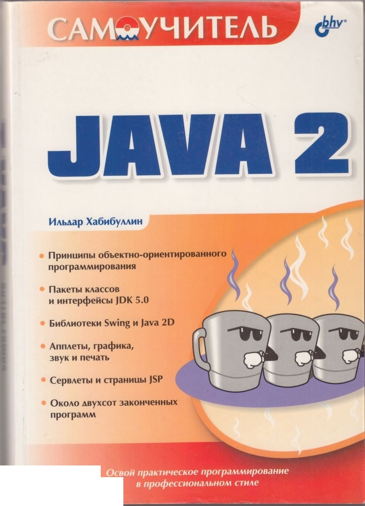
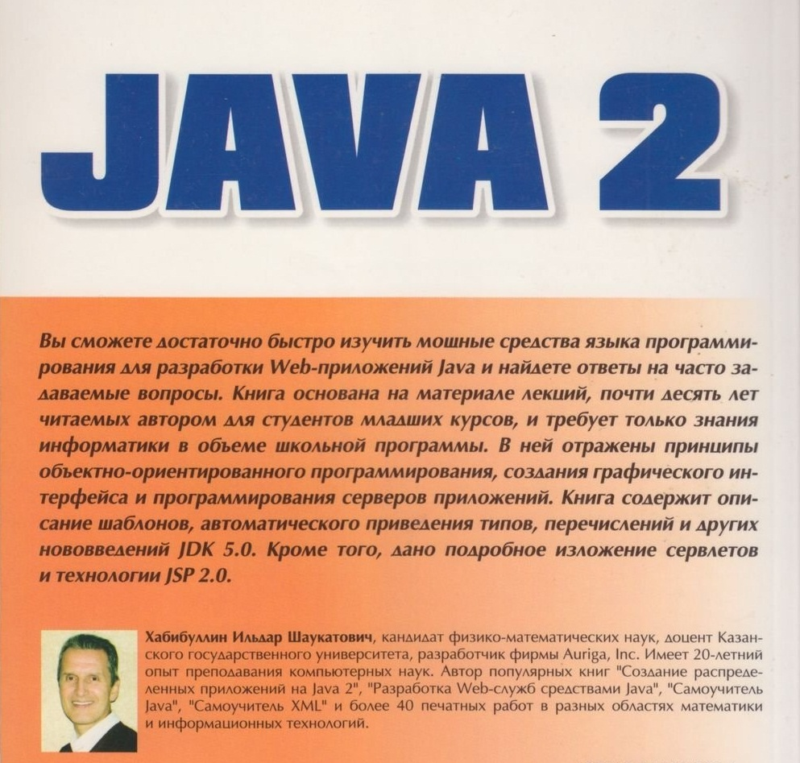

### Хабибуллин Ильдар
# Самоучитель Java 2

 

Санкт-Петербург

"БХВ-Петербург" 

2005

[Оглавление](tconts.md)

* [Введение](introduction.md)
* [Часть I. Базовые конструкции языка Java](chapter-1.md)
  * [Глава 1. Встроенные типы данных, операции над ними](chapter-1.md)
  * [Глава 2. Объектно-ориентированное программирование в Java](chapter-2.md)
